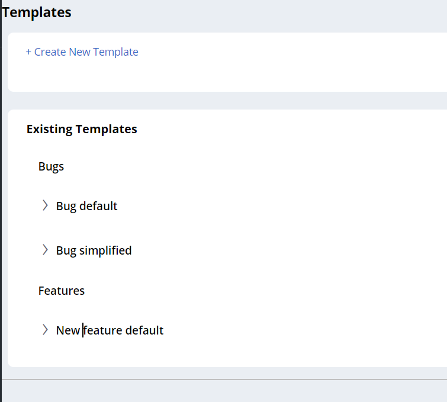

# QA-Checklist

Quality Checklist is an application initially written in Pega 7.4 and later upgraded to newest platform version (Pega 8.8.1 as of February 2021). 

Main goal of this application is to **improve quality of development** using Pega platform.

Application tracks formal documentation of quality measures taken during and after developing user story and before handing it over to testing team. Application allows to configure Quality checklist form (per project) and customizes approval workflow (who needs to approve checklist).

---

Main application features include:

 - ability o setup project structure (project with releases and sprints)
 
 - each object has its own lifecycle as it was implemented as case type
 
 - possibility to customize checklist questions 
 - possibility to customize approval workflow (who needs to approve checklist)
 - It is possible to assign this configuration per project
 - generate PDF with all relevant information (checklist questions with answers and approval details).

